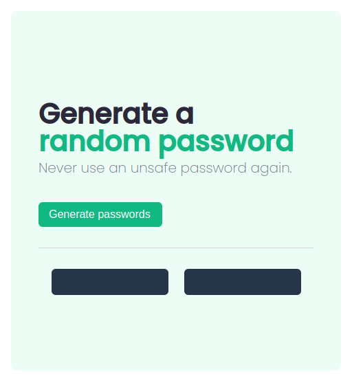

# password-generator

This is a solution to the Password Generator, a solo project from Scrimba.

## Table of contents

- [Overview](#overview)
  - [The requirements](#the-requirements)
  - [Screenshot](#screenshot)
  - [Links](#links)
- [My process](#my-process)
  - [Built with](#built-with)
  - [What I learned](#what-i-learned)
  - [Continued development](#continued-development)
  - [Useful resources](#useful-resources)

## Overview

### The requirements

- Build the project from scratch
- Generate two random passwords when the user clicks the button
- Each password should be 15 characters long

### Screenshot




### Links

- Solution URL: [https://github.com/florenzjrel/password-generator](https://github.com/florenzjrel/password-generator)
- Live Site URL: [https://florenzjrel.github.io/password-generator/](https://florenzjrel.github.io/password-generator/)

## My process

### Built with

- HTML
- CSS
- JavaScript DOM Manipulation


### What I learned

Code snippets that I'm proud of:

```js
function generateRandomPass() {
  let pass = "";
  for (let i = 0; i < 15; i++) {
    let randomIndex = Math.floor(Math.random() * charPass.length);
    pass += charPass[randomIndex];
  }

  return pass;
}
```

This is the first project I've used JavaScript to manipulate DOM and I've enjoyed learning it so much because DOM manipulation is really one of the essential topics to practice in front-end development.

### Continued development

Because of this project, I want to continue focusing on learning/deep-diving JavaScript and also being comfortable with the many possibilities you can do by just manipulating the DOM :D


### Useful resources

- [scrimba.com](https://scrimba.com) - Scrimba helped me gain confidence in learning to code, especially loved their Frontend Career Path. It paved the way for me as a career shifter. I really liked their teaching methods and will forever be grateful to them.
